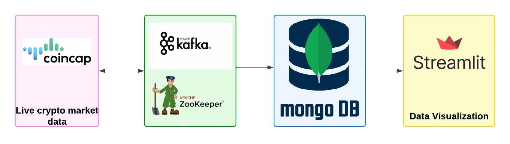

# Real-Time Cryptocurrency Data Analysis

## 📄 Description

This project performs **real-time analysis, visualization, and storage** of cryptocurrency data using **Apache Kafka**, **Apache Spark**, and **MongoDB**. It fetches live cryptocurrency prices from the API endpoint [api.coincap.io/v2/assets](https://api.coincap.io/v2/assets), processes the data, and streams it for real-time analytics. 

## 🛠️ Architecture
The project follows a **Producer-Consumer** pattern:
- **Producer**: Continuously fetches cryptocurrency data from the API and publishes it to a Kafka topic.
- **Consumer**: Consumes data from the Kafka topic, processes it using Apache Spark, and stores the processed data in MongoDB for further visualization.



---

## 🛠️ Technologies Used

- **Apache Kafka**: For real-time data streaming between producer and consumer.
- **Apache Spark**: To process and analyze data in real-time.
- **MongoDB**: For storing processed data to support visualization and reporting.
- **Python (matplotlib)**: For visualizing the stored data.

---

## ⚙️ Initial Setup

Follow the steps below to set up the project on your local system:

### Step 1: Download and Extract Kafka
```
wget https://downloads.apache.org/kafka/3.8.1/kafka_2.12-3.8.1.tgz
tar -xvf kafka_2.12-3.8.1.tgz
cd kafka_2.12-3.8.1
```

### Step 2: Start Zookeeper Server
```
bin/zookeeper-server-start.sh config/zookeeper.properties
```

### Step 3: Start Kafka Server
```
bin/kafka-server-start.sh config/server.properties
```

### Step 4: Create a Kafka Topic
```
bin/kafka-topics.sh --create --topic crypto-currency --bootstrap-server localhost:9092 --partitions 1 --replication-factor 1
```

### Step 5: Start Producer
```
bin/kafka-console-producer.sh --topic crypto-currency --bootstrap-server localhost:9092
```

### Step 6: Start Consumer
```
bin/kafka-console-consumer.sh --topic crypto-currency --bootstrap-server localhost:9092 --from-beginning
```

### Step 7: Install MongoDB
```
brew tap mongodb/brew
brew install mongodb-community
brew services start mongodb/brew/mongodb-community
```

  